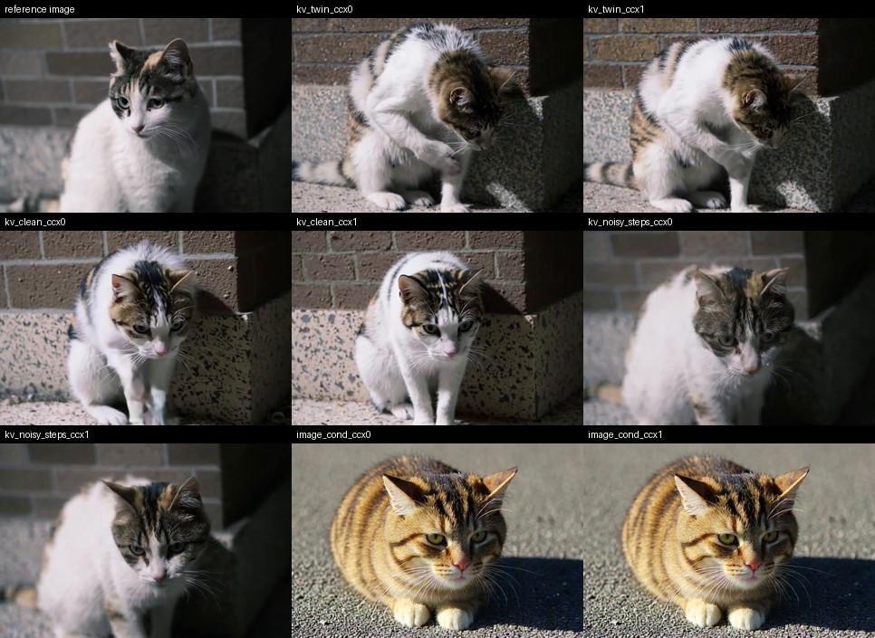
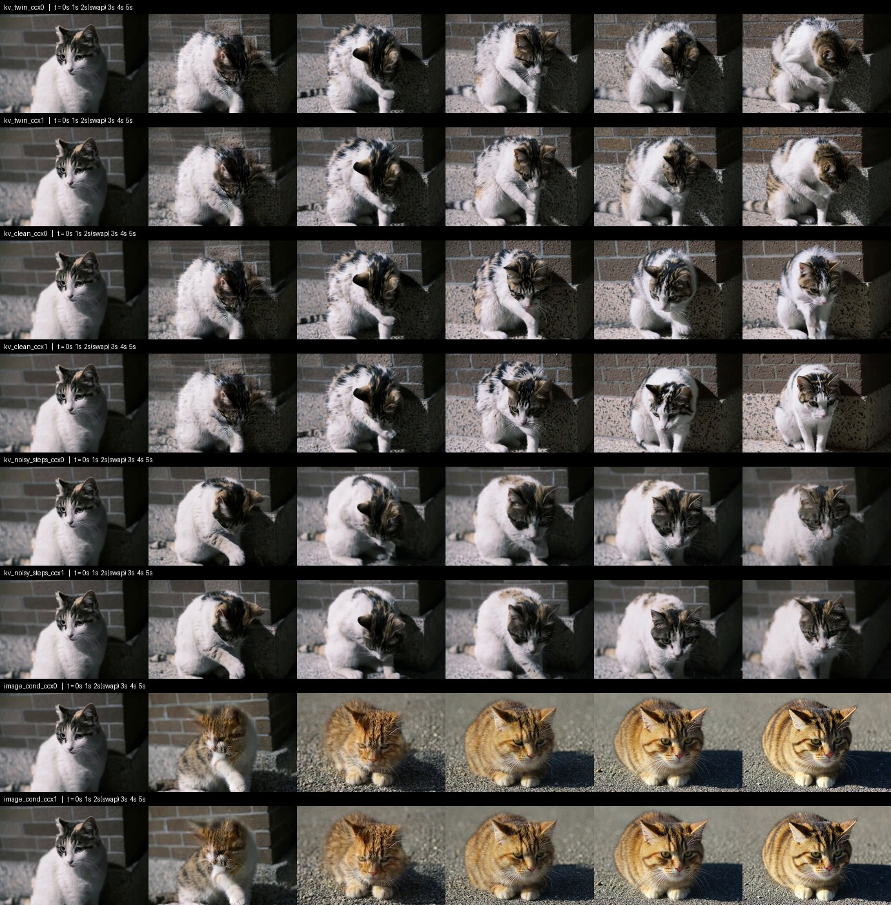

# Streaming ablation: does the anchor carry the subject across a prompt change?

An 8-cell grid over the four streaming strategies and `cache_cross_attn`, run with a
prompt swap in the middle of generation.

The point is the swap. The first prompt names the subject and the action; the second
names only an action and **never mentions the cat**:

| | |
|---|---|
| Reference image | a white-and-grey tabby in front of a stone brick wall |
| Prompt A (chunks 1–2, 0 → 2.04 s) | `A kitten lowers its head and licks its paw.` |
| Prompt B (chunks 3–5, 2.04 → 5.04 s) | `looks at the camera` |

If the subject survives prompt B, it can only have come from the never-evicted
`[image | chunk 1]` anchor and the cached history, because the text no longer supplies
it. That is the interaction property the streaming design is supposed to give.

Held fixed across all eight cells: `seed=42`, 121 frames, 768×512, 24 fps, 15 steps,
`window_chunks=1`, `chunk_frames=3`, distilled 22B transformer, conv video VAE. The
image-conditioning CRF is resolved from the checkpoint rather than left at the
interactive default.

The swap point is derived, not guessed. With `chunk_frames=3` the causal VAE emits
`1 + 24(i+1)` pixel frames through chunk *i*, so chunk 2 ends at frame 49 = 2.042 s and
prompt B applies to chunks 3–5.

## What happened

**All three `kv_*` strategies kept the cat. `image_cond` did not.**

Under `image_cond` the animal becomes a different, ginger cat on a different surface.
That path conditions each chunk on the previous chunk's last frame and keeps no
attention history, so identity has nothing to hold it. The colour statistics say the
same thing as the eye — mean `R − B` over the final frame, against the reference image:

| cell | warmth (R − B) | vs reference | L1 vs reference |
|---|---|---|---|
| reference image | 2.46 | — | — |
| `kv_noisy_steps_ccx0` | 4.41 | +1.96 | 33.47 |
| `kv_noisy_steps_ccx1` | 4.46 | +2.00 | 35.90 |
| `kv_twin_ccx0` | 7.13 | +4.68 | 44.92 |
| `kv_twin_ccx1` | 8.82 | +6.36 | 46.87 |
| `kv_clean_ccx0` | 8.50 | +6.04 | 36.98 |
| `kv_clean_ccx1` | 10.55 | +8.09 | 36.86 |
| **`image_cond_ccx0/1`** | **27.18** | **+24.72** | **59.52** |

`image_cond` deviates more than three times as far as the worst `kv_*` cell.

**Response to the subject-less prompt differs by strategy.** `kv_clean` reacts most (the
cat sits up and faces the camera), `kv_noisy_steps` partially (head up, gaze still
down), `kv_twin` least — at 5 s it is still grooming. That ordering is plausible for
`kv_twin`, whose history reads noisy until the final step and therefore carries the most
inertia, but see the caveat below.

**`cache_cross_attn` matters much less than the choice of strategy.** Within a strategy
the two rows differ far less than strategies differ from each other.

## Two built-in controls

`image_cond_ccx0` and `image_cond_ccx1` are **frame-identical** (same md5, max pixel
difference 0). That is the designed behaviour — the strategy has no attention history
for a cross-attention cache to read — and it doubles as a determinism check on the
harness.

`kv_noisy_steps` + `cache_cross_attn` does not fit in 97 GB: that strategy already keeps
`num_steps` noisy K/V snapshots per history chunk, and caching a2v/v2a on top exhausted
the card (`expandable_segments` did not save it). It was completed with
`OffloadMode.CPU`, which streams the DiT from host RAM. Offloading should change only
where weights live, so that was verified rather than assumed: re-running the
already-completed `kv_noisy_steps_ccx0` cell with offload reproduced the non-offload
result **exactly** (identical md5, max pixel difference 0). The offloaded cell is
therefore comparable to the other seven.

## Caveat

Every cell is a **single sample at seed 42**, so differences between strategies are
confounded with sampling noise. The identity result is far too large to be noise — the
ginger cat is not a sampling artefact — but the ordering of "response strength" among
the `kv_*` strategies is an observation, not a conclusion. Establishing it needs several
seeds per cell.

## Files

- `clips/*.mp4` — the eight cells, 768×512, 24 fps, 121 frames, with jointly generated audio.
- `final_frames.jpg` — reference image plus each cell's last frame.
- `contact_sheet.jpg` — per-cell filmstrip at 0/1/2/3/4/5 s; the swap lands between columns 3 and 4.
- `stats.json` — per-cell frame count, mean frame-to-frame motion before and after the swap, and drift from the first frame.
